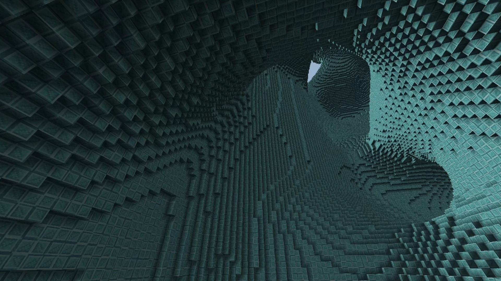

<h2>Overview</h2>
 > Date: December 2021
 > Languages: C++, GLSL
 > Libraries: OpenGL, GLFW
 > IDE: Visual Studio 2019
 > Purpose: Learning C++ and OpenGL
 > Learning Sources: TheCherno OpenGL series, Victor Gordan OpenGL series
 > Time Spent: 10 days

<h2>Summary</h2>

 This project is a C++ application which renders a static grid of voxels using the OpenGL rendering pipeline. During testing, I have managed to render 32,768,000 voxels at a crisp framerate. To achieve this, multiple optimizations have been made. Each voxel is stored as a Short, enumerated as a "Block", and held within a "Chunk". These abstractions make mesh generation simpler. Every block has a certain light level. By iterating over every chunk and comparing neighbors, we can generate a mesh of triangles for every visible surface in the scene. Additional calculation is done to determine where shadows should be placed in between edges (voxel-space ambient occlusion). This mesh data is bitpacked and sent to a shader that parses bitwise position and lighting data, then applies a texture using that information. This is all rasterized using OpenGL and sent to the GLFW window. Additional shader math is done to create a player camera that can explore the scene. 

<h2>Demonstrations</h2>

Here you can see a scene of 3d Perlin noise used to create sweeping curves.

At this angle, you can see the extreme scale of the grid being rendered. This is real-time.

In this block layout, you can see how the ambient occlusion works even in tight spaces.
The shadows are exaggerated for effect in this demonstration.

Shaders allow rapid iteration of effects on color or warped terrain. In this scene, colors are rapidly
washing over every block in a looping sine rainbow pattern.

Another effect utilized is UV rotation. In mesh generation, each block face is given a random
rotation to break up repeating textures, visible in all these screenshots. This is especially helpful 
because there is no anti-aliasing for distant textures.

Up close, you can see the edges of cubes are crisp. Near-parallel faces are still rendered in full color,
giving an intense experience of perspective and immersion.

